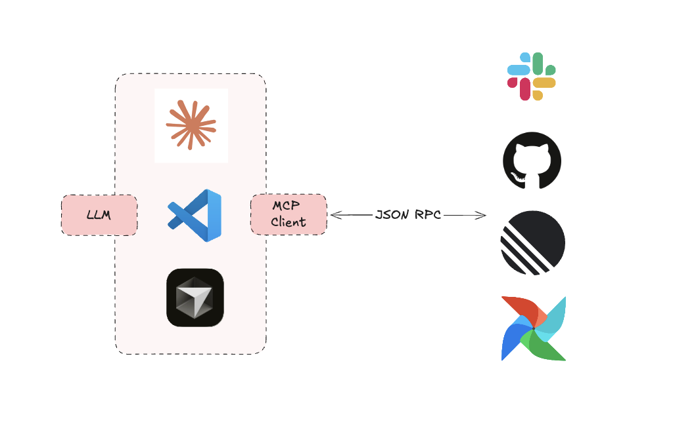

::header::

# MCP by Anthropic
::content::

>The Model Context Protocol is an open standard that enables developers to build secure, two-way connections between their data sources and AI-powered tools. - Anthropic

---
layout: blue-sidebar
title: Why MCP?
---

::header::

# Why MCP?
Life before MCP

::content::

---
layout: blue-sidebar
title: Why MCP?
---

::header::

# MCP world of opportunities

::content::

---
title: MCP Architecture
layout: blue-sidebar
---

::header::

## MCP Architecture

::content::

- **MCP Host**: 
The AI application that coordinates and manages one or multiple MCP clients

- **MCP Client**: 
A component that maintains a connection to an MCP server and obtains context from an MCP server for the MCP host to use

- **MCP Server**:
 A program that provides context to MCP clients

---
layout: blue-title-slide
---

## Demo