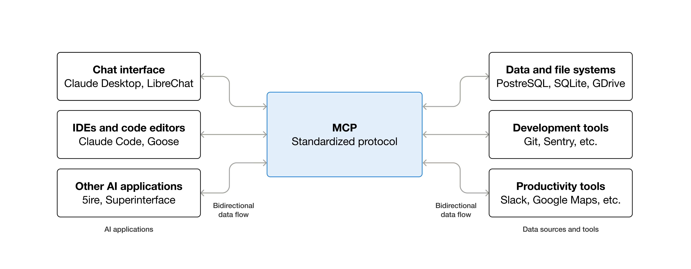
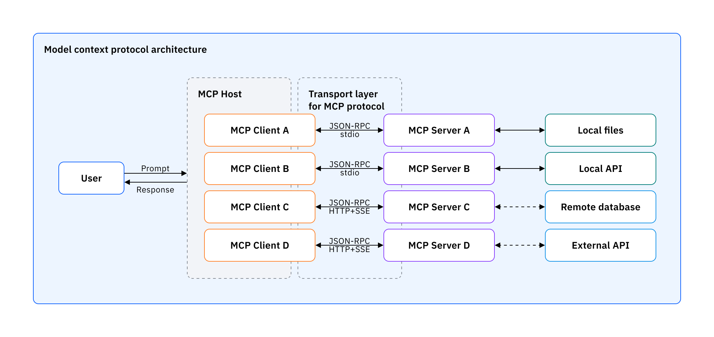

::header::

# Introduction to MCP
::content::

>The Model Context Protocol is an open standard that enables developers to build secure, two-way connections between their data sources and AI-powered tools. - Anthropic

---
layout: blue-sidebar
title: How LLMs work?
---

::header::

# Why MCP?
Life before MCP

::content::

---
title: What MCP Provides?
hideInToc: true
layout: blue-sidebar
---

::header::

# What MCP Provides?

::content::

<v-clicks>

1. Abstraction
2. Dynamism
3. Low-Coupling
4. Clean-interface

</v-clicks>

---
title: MCP Architecture
hideInToc: true
layout: blue-sidebar
---

::header::

## MCP Architecture

::content::

- **MCP Host**: 
The AI application that coordinates and manages one or multiple MCP clients

- **MCP Client**: 
A component that maintains a connection to an MCP server and obtains context from an MCP server for the MCP host to use

- **MCP Server**:
 A program that provides context to MCP clients

---
title: MCP Layers of Communication
hideInToc: true
layout: blue-sidebar
---

::header::

## MCP Layers of Communication

::content::

<v-clicks>

- **Data layer**: 
  - JSON-RPC based protocol for client-server communication 
  - lifecycle management
  - tools, resources, prompts, notifications.

- **Transport layer**: 
  - Network transport-specific details
  - Connection establishment
  - Message framing 
  - Authorization.

</v-clicks>

