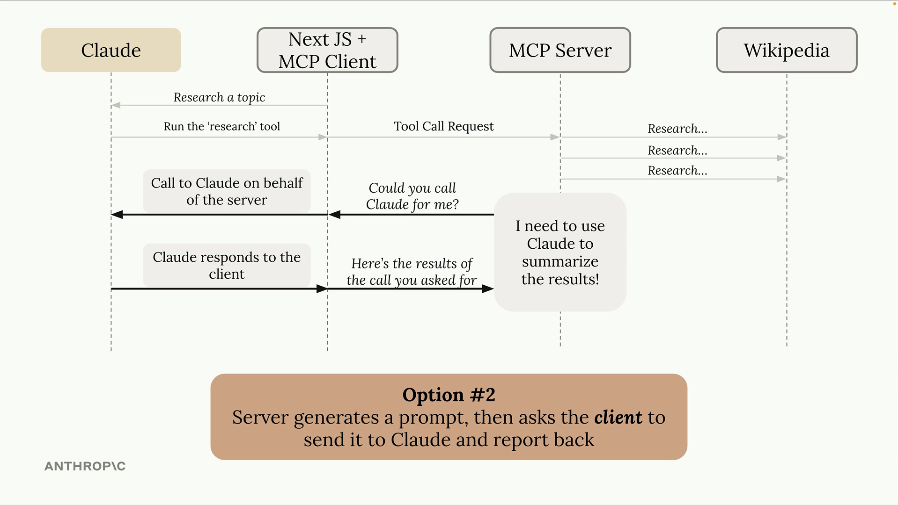
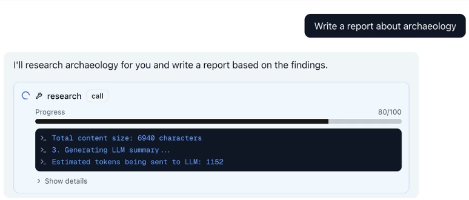
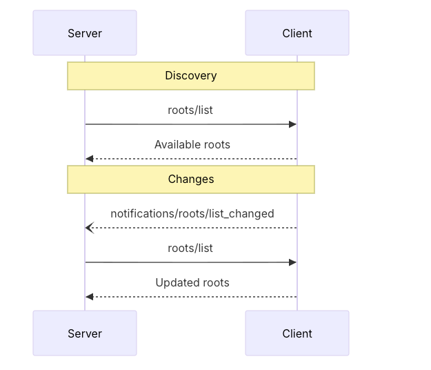

# MCP Primitives

---
title: MCP Layers of Communication
layout: blue-sidebar
---

::header::

## MCP Layers of Communication

::content::

<v-clicks>

- **Data layer**: 
  - JSON-RPC based protocol for client-server communication 
  - lifecycle management
  - tools, resources, prompts, notifications.

- **Transport layer**: 
  - Network transport-specific details
  - Connection establishment
  - Message framing 
  - Authorization.

</v-clicks>

---
title: MCP Primitives
layout: blue-sidebar
hideInToc: true
---

::header::

## MCP Primitives

::content::

<v-clicks>

- **Server**
  - Tools
  - Resources
  - Prompts
- **Client**
  - Sampling
  - Roots
  - Elicitation
- **Notifications**

</v-clicks>

---
title: MCP Server Primitives
hideInToc: true
layout: blue-sidebar
---

::header::

# MCP Server Primitives

::content::

| Feature   | Examples                                | Who controls it |
|-----------|-----------------------------------------|-----------------|
| Tools     | Search flights Send messages Create calendar events | Model |
| Resources | Retrieve documents Access knowledge bases Read calendars | Application |
| Prompts   | Plan a vacation Summarize my meetings Draft an email | User |

---
layout: blue-sidebar
hideInToc: true
---

::header::

## MCP Client Primitives

::content::

| Feature     | Example          |
|-------------|------------------|
| Sampling    | Handing off LLM Calling responsibility to client |
| Roots       | Read specific files |
| Elicitation | Ask user details  |

---
layout: blue-sidebar
hideInToc: true
---

::header::

## Sampling

::content::

- Server makes the request back to client to use the LLM
- Server doesn't have to make decisions for client's preferences
- Eg., Research MCP server, some users might like short answers, some like detailed reports with references

---
layout: blue-sidebar
hideInToc: true
---

::header::

## Notifications

::content::

- Server progress tracking
- Alerting on intermediate steps

---
layout: blue-sidebar
hideInToc: true
---

::header::

## Roots

::content::

- Grant permission to specific files
- Client specifying a root has no meaning unless there is a server implementation to support it

