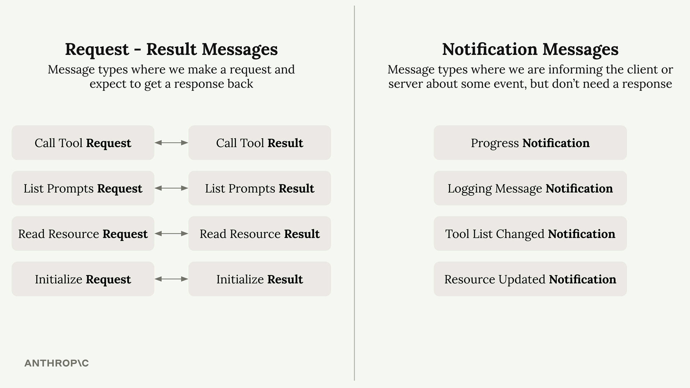
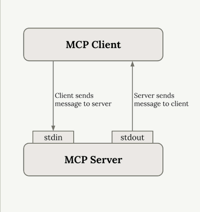

# MCP Communication

---
layout: blue-sidebar
---

::header::

## MCP Communication

::content::

- MCP communicates via JSON
- JSON can be sent over by multiple ways
  - Stdio
  - Streamable HTTP

---
layout: blue-sidebar
---

::header::

## MCP Message types

::content::

---
layout: blue-sidebar
---

::header::

## Stdio

::content::

---
layout: blue-sidebar
---

::header::

## Streamable HTTP

::content::

